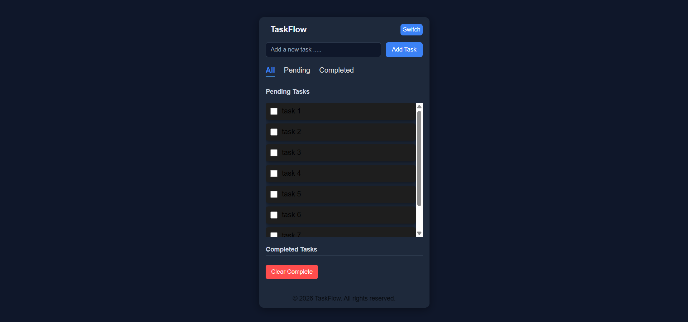
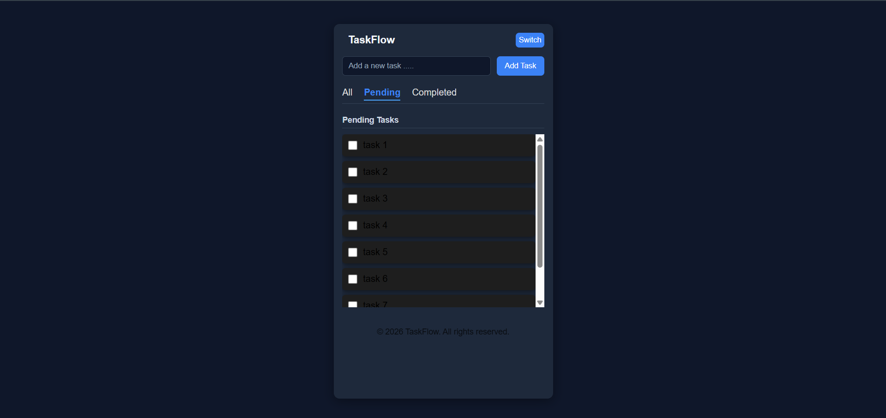
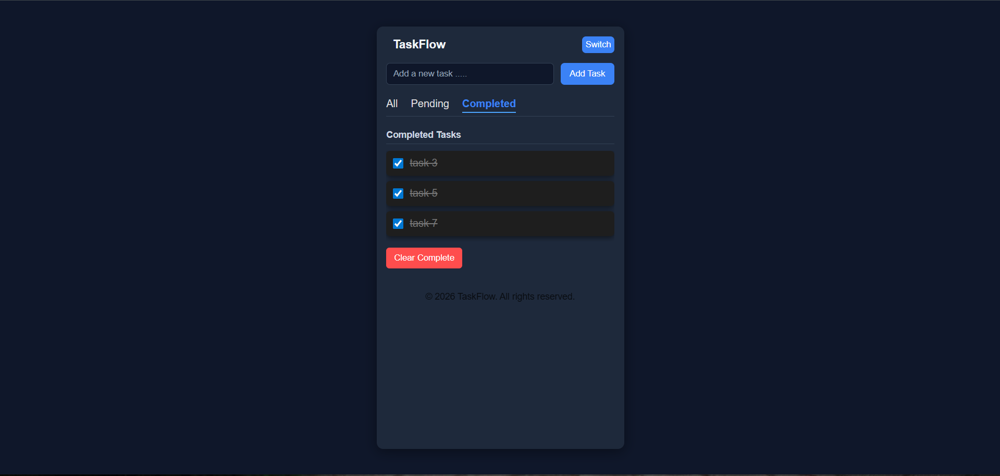

📌 TaskFlow – To-Do App
TaskFlow is a simple and clean To-Do web application built using HTML, CSS, and JavaScript.
It helps users manage their daily tasks efficiently with separate sections for pending and completed tasks.

🚀 Live Demo
🔗 Live Link: (https://harshpatil25.github.io/TaskFlow/)

🛠️ Built With
HTML5
CSS3 (Light & Dark Theme)
Vanilla JavaScript

✨ Features
➕ Add new tasks
📌 View pending tasks
✅ Mark tasks as completed
🌙 Toggle between Light and Dark theme
📂 Separate pages for:
Home
Pending Tasks
Completed Tasks
💾 Data handling using JavaScript

📂 Project Structure

TaskFlow/
│
├── index.html
├── pending.html
├── completed.html
├── script.js
├── style-light.css
├── style-dark.css
└── README.md

📸 Screenshots

🎯 Purpose of This Project
This project was built to:
Practice DOM manipulation
Improve JavaScript logic building
Understand multi-page structure
Learn basic theme switching

🧠 What I Learned
Handling user input dynamically
Updating UI using JavaScript
Managing task states (pending/completed)
Structuring a clean frontend project

📌 Future Improvements
Add task edit option
Add due dates
Add local storage for persistent data
Convert into single-page application
Make responsive for mobile devices

👤 Author
Harsh Patil
